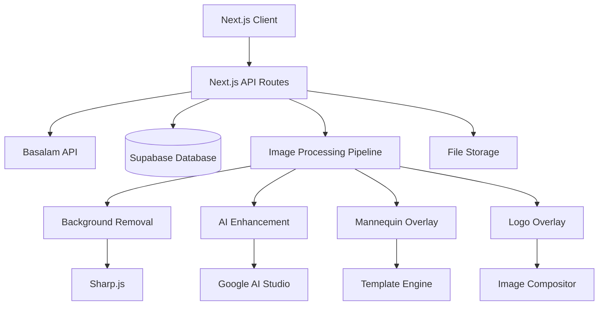
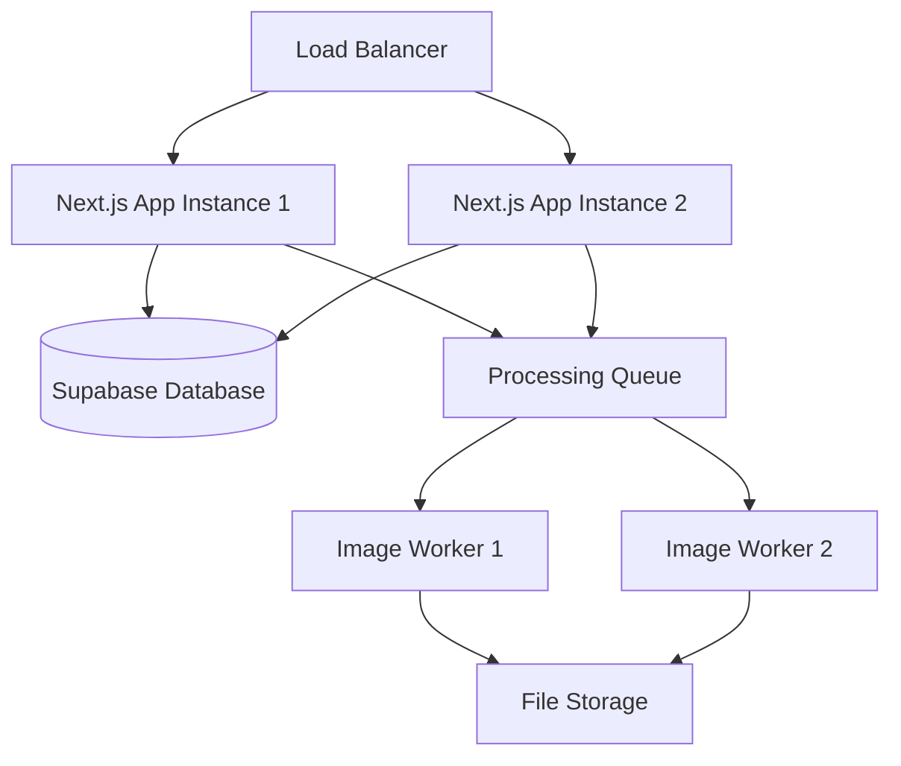

# Design Document

## Overview

The Basalam Image Editor completion focuses on implementing a comprehensive AI-powered image enhancement platform that integrates with Basalam's e-commerce APIs. The system will provide background removal, quality enhancement, mannequin preview, and brand logo overlay capabilities while maintaining secure authentication and credit management.

## Architecture

### High-Level Architecture



### Technology Stack

- **Frontend**: Next.js 14 with App Router, TypeScript, Tailwind CSS
- **Backend**: Next.js API Routes, Node.js
- **Database**: Supabase (PostgreSQL)
- **Image Processing**: Sharp.js, Google AI Studio nano banana model
- **Authentication**: Basalam PAT with server-side session management
- **File Storage**: Local filesystem with optional Supabase Storage integration

## Components and Interfaces

### 1. Authentication System Enhancement

**Current State**: Basic PAT authentication exists
**Enhancement Needed**: Improve session management and security

```typescript
interface AuthSession {
  userId: string;
  accessToken: string;
  vendorId: number | null;
  expiresAt: Date;
  lastActivity: Date;
}

interface AuthService {
  validatePAT(token: string): Promise<BasalamUser>;
  createSession(user: BasalamUser, token: string): Promise<AuthSession>;
  getActiveSession(): Promise<AuthSession | null>;
  refreshSession(sessionId: string): Promise<AuthSession>;
  revokeSession(sessionId: string): Promise<void>;
}
```

### 2. Image Processing Pipeline

**New Component**: Core image enhancement system

```typescript
interface ImageProcessingJob {
  id: string;
  userId: string;
  status: 'queued' | 'processing' | 'completed' | 'failed';
  inputFile: ProcessingFile;
  outputFile?: ProcessingFile;
  steps: ProcessingStep[];
  createdAt: Date;
  completedAt?: Date;
  errorMessage?: string;
}

interface ProcessingStep {
  name: 'background_removal' | 'enhancement' | 'mannequin' | 'logo_overlay';
  status: 'pending' | 'processing' | 'completed' | 'failed';
  config: Record<string, any>;
  duration?: number;
}

interface ImageProcessor {
  processImage(job: ImageProcessingJob): Promise<ProcessingResult>;
  removeBackground(input: Buffer): Promise<Buffer>;
  enhanceQuality(input: Buffer): Promise<Buffer>;
  addMannequin(input: Buffer, template: string): Promise<Buffer>;
  addLogoOverlay(input: Buffer, logo: Buffer, config: LogoConfig): Promise<Buffer>;
}
```

### 3. Credit Management System

**New Component**: Usage tracking and credit management

```typescript
interface CreditService {
  getUserBalance(userId: string): Promise<number>;
  deductCredits(userId: string, amount: number, reason: string): Promise<boolean>;
  addCredits(userId: string, amount: number, reason: string): Promise<void>;
  getTransactionHistory(userId: string): Promise<CreditTransaction[]>;
  canProcessImage(userId: string): Promise<boolean>;
}

interface CreditTransaction {
  id: string;
  userId: string;
  delta: number;
  balance: number;
  reason: string;
  createdAt: Date;
}
```

### 4. Enhanced Product Management

**Enhancement**: Improve existing product management with better UI and features

```typescript
interface ProductService {
  getVendorProducts(vendorId: number, filters: ProductFilters): Promise<Product[]>;
  getProductDetails(productId: number): Promise<ProductDetail>;
  createProduct(vendorId: number, product: CreateProductRequest): Promise<Product>;
  updateProduct(productId: number, updates: UpdateProductRequest): Promise<Product>;
  uploadProductImages(productId: number, images: File[]): Promise<ProductImage[]>;
}

interface ProductFilters {
  status?: 'active' | 'inactive' | 'draft';
  category?: string;
  priceRange?: [number, number];
  stockStatus?: 'in_stock' | 'out_of_stock';
  search?: string;
}
```

### 5. Real-time Job Status System

**New Component**: WebSocket-based status updates

```typescript
interface JobStatusService {
  subscribeToJob(jobId: string): EventSource;
  updateJobStatus(jobId: string, status: JobStatus): Promise<void>;
  getJobProgress(jobId: string): Promise<JobProgress>;
}

interface JobProgress {
  jobId: string;
  currentStep: string;
  completedSteps: number;
  totalSteps: number;
  estimatedTimeRemaining: number;
  message: string;
}
```

## Data Models

### Enhanced Database Schema

```sql
-- Enhanced users table
ALTER TABLE users ADD COLUMN credits_balance INTEGER DEFAULT 0;
ALTER TABLE users ADD COLUMN last_activity TIMESTAMPTZ DEFAULT NOW();

-- Enhanced sessions table  
ALTER TABLE sessions ADD COLUMN last_activity TIMESTAMPTZ DEFAULT NOW();
ALTER TABLE sessions ADD COLUMN user_agent TEXT;

-- Enhanced image_jobs table
ALTER TABLE image_jobs ADD COLUMN progress_percentage INTEGER DEFAULT 0;
ALTER TABLE image_jobs ADD COLUMN estimated_completion TIMESTAMPTZ;
ALTER TABLE image_jobs ADD COLUMN processing_config JSONB;

-- New tables
CREATE TABLE processing_templates (
  id UUID PRIMARY KEY DEFAULT gen_random_uuid(),
  name TEXT NOT NULL,
  type TEXT NOT NULL, -- 'mannequin', 'logo_position'
  config JSONB NOT NULL,
  preview_url TEXT,
  created_at TIMESTAMPTZ DEFAULT NOW()
);

CREATE TABLE user_preferences (
  id UUID PRIMARY KEY DEFAULT gen_random_uuid(),
  user_id UUID REFERENCES users(id) ON DELETE CASCADE,
  preferences JSONB NOT NULL DEFAULT '{}',
  updated_at TIMESTAMPTZ DEFAULT NOW()
);
```

## Error Handling

### Error Classification

1. **Authentication Errors**: Invalid tokens, expired sessions
2. **Processing Errors**: Image format issues, AI service failures
3. **Credit Errors**: Insufficient balance, transaction failures
4. **API Errors**: Basalam API failures, rate limiting
5. **System Errors**: Database failures, file system issues

### Error Response Format

```typescript
interface APIError {
  code: string;
  message: string;
  details?: Record<string, any>;
  timestamp: string;
  requestId: string;
}

// Error codes
const ERROR_CODES = {
  AUTH_INVALID_TOKEN: 'AUTH_001',
  AUTH_SESSION_EXPIRED: 'AUTH_002',
  CREDITS_INSUFFICIENT: 'CREDITS_001',
  PROCESSING_FAILED: 'PROCESSING_001',
  PROCESSING_UNSUPPORTED_FORMAT: 'PROCESSING_002',
  API_RATE_LIMITED: 'API_001',
  SYSTEM_UNAVAILABLE: 'SYSTEM_001'
} as const;
```

### Retry Logic

```typescript
interface RetryConfig {
  maxAttempts: number;
  backoffMultiplier: number;
  initialDelay: number;
  maxDelay: number;
}

const RETRY_CONFIGS = {
  imageProcessing: { maxAttempts: 3, backoffMultiplier: 2, initialDelay: 1000, maxDelay: 10000 },
  basalamAPI: { maxAttempts: 2, backoffMultiplier: 1.5, initialDelay: 500, maxDelay: 5000 },
  creditTransaction: { maxAttempts: 1, backoffMultiplier: 1, initialDelay: 0, maxDelay: 0 }
};
```

## Testing Strategy

### Unit Testing

- **Authentication Service**: Token validation, session management
- **Image Processing**: Individual processing steps (background removal, enhancement)
- **Credit System**: Balance calculations, transaction integrity
- **API Utilities**: Basalam API client functions

### Integration Testing

- **End-to-End Processing**: Complete image processing pipeline
- **Database Operations**: CRUD operations with proper error handling
- **External API Integration**: Basalam API calls with various scenarios

### Performance Testing

- **Image Processing**: Large file handling, concurrent processing
- **Database Queries**: Query optimization for product listings
- **Memory Management**: Image buffer handling and cleanup

### Test Data Management

```typescript
interface TestDataFactory {
  createTestUser(): Promise<TestUser>;
  createTestImage(format: 'jpeg' | 'png', size: 'small' | 'large'): Buffer;
  createTestProduct(): ProductData;
  setupTestCredits(userId: string, amount: number): Promise<void>;
  cleanupTestData(): Promise<void>;
}
```

## Security Considerations

### Token Security

- Store encrypted tokens in database
- Implement token rotation for long-lived sessions
- Use secure HTTP-only cookies for session management
- Validate token expiration and refresh as needed

### File Upload Security

- Validate file types and sizes
- Scan uploaded files for malicious content
- Implement rate limiting per user
- Store files in isolated directories

### API Security

- Implement request rate limiting
- Validate all input parameters
- Use CORS policies appropriately
- Log security events for monitoring

## Performance Optimizations

### Image Processing

- Implement processing queue with worker threads
- Use streaming for large file processing
- Cache processed results for common operations
- Optimize image formats and compression

### Database Performance

- Index frequently queried columns
- Implement connection pooling
- Use read replicas for heavy queries
- Cache frequently accessed data

### Frontend Performance

- Implement progressive image loading
- Use Next.js Image optimization
- Implement client-side caching
- Optimize bundle size with code splitting

## Deployment Architecture

### Production Environment



### Environment Configuration

- **Development**: Single instance with local processing
- **Staging**: Multi-instance with shared database and queue
- **Production**: Load-balanced with dedicated worker nodes

### Monitoring and Logging

- Application performance monitoring (APM)
- Error tracking and alerting
- Processing job metrics and analytics
- User activity and usage patterns